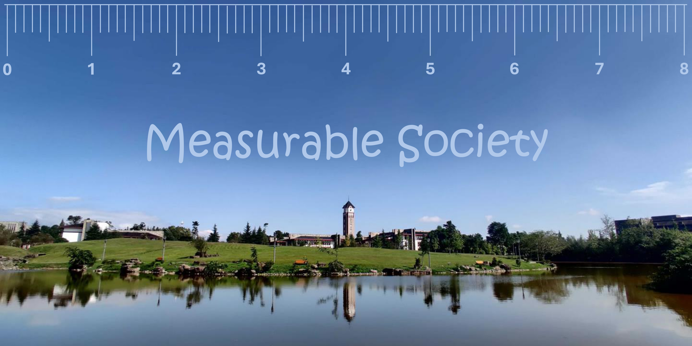

# Introduction
"Measurable Society" is a public elective course at Chengdu Neusoft University, designed to show undergraduate students the basic statistical concepts, some popular inferential methods, and their applications in analyzing today's social issues.

The course will be taught through a combination of theories and cases, allowing students to understand the principles of statistics and at the same time understand the application of regression models. The real-life cases cover a wide range of topics, such as return to education, workplace wellness, social network, etc., and involve research projects from the world's top scholars (such as Nobel Prize laureate [Joshua D. Angrist](https://economics.mit.edu/people/faculty/josh-angrist)) to help students gain an in-depth understanding of how a social issue is *measured* and analyzed. In addition, this course provides students with new ideas, paves the way for their future dissertations, and cultivate students' independent thinking and data analysis skills.

Students interested in data analysis and social science, regardless of their majors, are welcome to take this course. Let us immerse ourselves in the wonderful world of social sciences and explore the mysterious stories behind the data!

# Content
1. **Probability Theory and Descriptive Statistics** (5 hours)
   * Introduction to *Measurable Society* ([Slides](https://github.com/IanHo2019/Measurable_Society/blob/main/Slides/20240914.1_Measurable_Society.pdf))
   * Probability: Definitions and Axioms ([Slides](https://github.com/IanHo2019/Measurable_Society/blob/main/Slides/20240923.1_Probability_Definitions_and_Axioms.pdf))
   * Random Variable: Definitions and Characterization ([Slides](https://github.com/IanHo2019/Measurable_Society/blob/main/Slides/20240923.2_Definition_and_Characterization_of_RV.pdf))
   * Independence versus Zero Correlation ([Slides](https://github.com/IanHo2019/Measurable_Society/blob/main/Slides/20240930.1_Independence_VS_Uncorrelatedness.pdf))
2. **Inferential Statistics and Regression Model** (5 hours)
   * Sampling and Estimation ([Slides](https://github.com/IanHo2019/Measurable_Society/blob/main/Slides/20240930.2_Sampling_and_Estimation.pdf))
   * Conditional Expectation and Linear Model ([Slides](https://github.com/IanHo2019/Measurable_Society/blob/main/Slides/20241014_CEF_and_Linear_Model.pdf))
   * Ordinary Least Squares ([Python](https://github.com/IanHo2019/Measurable_Society/blob/main/2024.10.21_Coding/Linear_Models.ipynb))
3. **Randomized Control Trial** (4 hours)
   * Case Study: [*Kelly, Ksoll & Magruder (2024)*](https://doi.org/10.1016/j.jdeveco.2023.103176) ([Slides](https://github.com/IanHo2019/Measurable_Society/blob/main/Slides/20241028_Digital_Platforms_Job_Search.pdf))
   * Case Study: [*Jones, Molitor & Reif (2019)*](https://doi.org/10.1093/qje/qjz023) ([Slides](https://github.com/IanHo2019/Measurable_Society/blob/main/Slides/20241104_Workplace_Wellness_Program.pdf))
   * Videos:
     * [India's Youth Unemployment](https://www.youtube.com/watch?v=6KaU08vRwos)
     * [Workplace Wellness Program](https://www.youtube.com/watch?v=s-QbV_OstxQ)
     * [UIUC Campus Tour](https://www.youtube.com/watch?v=8Sr691Jfu5U)
4. **Instrumental Variable** (4 hours)
   * Case Study: [*Angrist & Krueger (1991)*](https://doi.org/10.2307/2937954) ([Slides](https://github.com/IanHo2019/Measurable_Society/blob/main/Slides/20241111_Return_to_Education.pdf))
   * Case Study: [*Nakamura, Sigurdsson & Steinsson (2022)*](https://doi.org/10.1093/restud/rdab062) ([Slides](https://github.com/IanHo2019/Measurable_Society/blob/main/Slides/20241125_Gift_of_Moving.pdf))
   * Videos:
     * [Is a Degree Worth the Financial Strain?](https://www.youtube.com/watch?v=tk_Iie0ZyAk)
     * [1973 Iceland Volcanic Eruption](https://www.youtube.com/watch?v=ghl33n26d44)
5. **Binary Choice Model** (2 hours)
   * Case Study: [*Ruhm & Black (2002)*](https://doi.org/10.1016/S0167-6296(02)00033-4) ([Slides](https://github.com/IanHo2019/Measurable_Society/blob/main/Slides/20241118_Drinking_and_Economic_Downturn.pdf))
   * Videos:
     * [How Does Alcohol Make You Drunk?](https://www.youtube.com/watch?v=gCrmFbgT37I)
     * [How Does Alcohol Cause Blackouts?](https://www.youtube.com/watch?v=rkXMdJY1SXQ)
6. **Panel Data and Event Study** (2 hours)
   * Case Study: [*Gallagher (2014)*](https://www.jstor.org/stable/43189495) ([Slides](https://github.com/IanHo2019/Measurable_Society/blob/main/Slides/20241202_Flood_Insurance.pdf))
   * Video: [Flood Insurance Explained](https://www.youtube.com/watch?v=FV_cBjrHG9Q)
8. **Difference-in-Differences and Triple Differences** (6 hours)
   * Case Study: [*Di Tella & Schargrodsky (2004)*](https://www.jstor.org/stable/3592772) ([Slides](https://github.com/IanHo2019/Measurable_Society/blob/main/Slides/20241209_Police_and_Crime.pdf))
   * Case Study: [*Gruber, Lin & Yi (2023)*](https://doi.org/10.1016/j.jpubeco.2023.104999) ([Slides](https://github.com/IanHo2019/Measurable_Society/blob/main/Slides/20241216_China_NCMS.pdf))
   * Case Study: [*Bai, Jia & Yang (2023)*](https://doi.org/10.1093/qje/qjac041)
   * Videos:
     * [Chilling Account of the AMIA Terror Attack](https://www.youtube.com/watch?v=eKtbfRiX3nM)
     * [The Path to a Healthy China](https://www.youtube.com/watch?v=Tt_LVaiQwkY)
     * [The Taiping Rebellion & Second Opium War: Every Day](https://www.youtube.com/watch?v=ypAd9UQ4zmg)
     * [Prosperous Suzhou: An 18th-Century Scroll Painting by Xu Yang](https://www.bilibili.com/video/BV1np4y1G7h3)
10. **Regression Discontinuity Design** (2 hours)

# Recommended Textbooks
* [*Mostly Harmless Econometrics: An Empiricist's Companion*](https://press.princeton.edu/books/paperback/9780691120355/mostly-harmless-econometrics) (Angrist & Pischke, 2009)
* [*Vital Statistics: Probability and Statistics for Economics and Business*](https://www.amazon.com/Vital-Statistics-Probability-Economics-Business/dp/0190668083) (Sandholm & Saraniti, 2018)
* [*Econometrics*](https://press.princeton.edu/books/hardcover/9780691235899/econometrics) (Hansen, 2022)
* [*Using Python for Introductory Econometrics*](https://www.amazon.com/Using-Python-Introductory-Econometrics-Florian/dp/B08924H17Y) (Heiss & Brunner, 2020)
